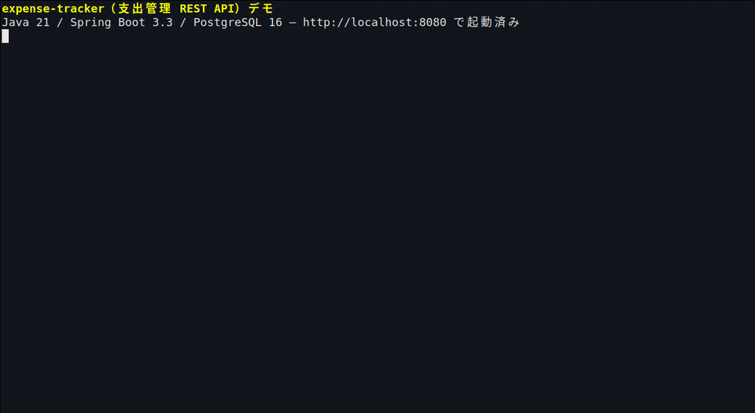

# Expense Management Rest API

**[日本語](#日本語) | [English](#english)**

---

<a id="日本語"></a>

## 日本語

個人の支出を記録・集計する **家計簿アプリのバックエンド REST API** を中心としたリポジトリです。

### 🎬 デモ（curl で経費 CRUD）

起動確認 → カテゴリ・支出の登録 → 一覧 → 更新 → 月次集計 → 削除 → バリデーションエラー（`{ "status", "message" }`）までを、実際に `curl` で操作した端末録画です（データはすべてダミー）。



> UI を持たない API のため、公開デモ URL の代わりに端末操作の録画を掲載しています。

### 📂 メインプロジェクト：[`expense-tracker/`](./expense-tracker/)

支出管理 API の本体です。カテゴリ・支出の登録／一覧／更新／削除と、月ごとの集計ができます。

- **技術スタック**：Java 21 / Spring Boot 3.3 / PostgreSQL 16 / Docker
- **起動方法**：`expense-tracker/` で `docker compose up --build`
- **使い方・API 一覧・curl 例**：[`expense-tracker/README.md`](./expense-tracker/README.md) に、初見の人向けの平易な解説（日本語・英語）があります

```bash
cd expense-tracker
docker compose up --build
# 起動後 http://localhost:8080 で待受
```

詳しい手順は **[expense-tracker の README](./expense-tracker/README.md)** をご覧ください。

<p align="right"><a href="#expense-management-rest-api">▲ 上に戻る / Back to top</a></p>

---

<a id="english"></a>

## English

This repository centers on a **backend REST API for a household expense-tracking app** that records and aggregates personal spending.

### 🎬 Demo (expense CRUD via curl)

A terminal recording of the actual `curl` flow: startup check → creating categories and expenses → listing → updating → monthly summary → deleting → a validation error returning `{ "status", "message" }` (all data is dummy data).


> Since this API has no UI, a terminal recording is provided instead of a public demo URL.

### 📂 Main project: [`expense-tracker/`](./expense-tracker/)

The expense management API itself. It supports creating, listing, updating, and deleting categories and expenses, plus monthly summaries.

- **Tech stack**: Java 21 / Spring Boot 3.3 / PostgreSQL 16 / Docker
- **How to start**: run `docker compose up --build` inside `expense-tracker/`
- **Usage, API reference, curl examples**: see [`expense-tracker/README.md`](./expense-tracker/README.md), which includes beginner-friendly explanations in both Japanese and English

```bash
cd expense-tracker
docker compose up --build
# After startup, it listens at http://localhost:8080
```

For detailed steps, see the **[expense-tracker README](./expense-tracker/README.md)**.

<p align="right"><a href="#expense-management-rest-api">▲ Back to top / 上に戻る</a></p>
