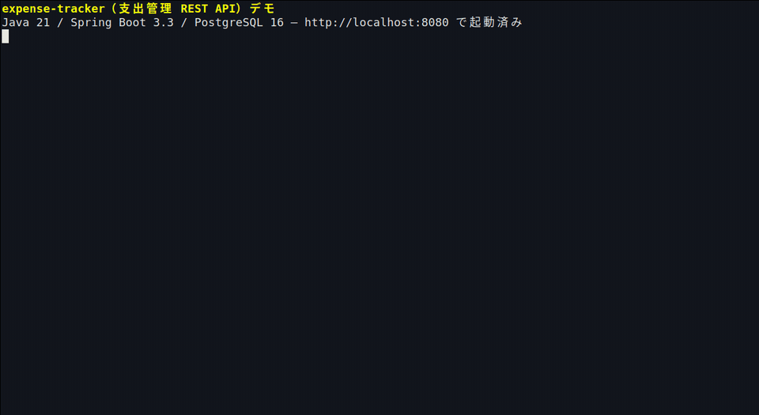

<a id="top"></a>

# Expense Management Rest API

**[日本語](#日本語) | [English](#english)**

---

<a id="日本語"></a>

# 支出管理 REST API

「いつ・何に・いくら使ったか」を記録して、月ごとに集計できる **家計簿アプリの裏側（バックエンド API）** です。
画面はありません。スマホアプリや Web 画面などの「表側」から呼び出して使うことを想定した、データのやり取り専用のプログラムです。

> **API とは？**
> アプリ同士がデータをやり取りするための「窓口」のことです。
> この窓口に「この支出を登録して」「6月の合計を教えて」とお願いすると、結果が返ってきます。
> やり取りは JSON という、人間にも読みやすいテキスト形式で行います。

---

## 🎬 デモ（curl で経費 CRUD）

起動確認 → カテゴリ・支出の登録 → 一覧 → 更新 → 月次集計 → 削除 → バリデーションエラー（`{ "status", "message" }`）までを、実際に `curl` で操作した端末録画です（データはすべてダミー）。



> UI を持たない API のため、公開デモ URL の代わりに端末操作の録画を掲載しています。

---

## できること

- **カテゴリ**（食費・交通費など、支出の分類）を登録・一覧表示する
- **支出**（1280円のランチ など）を登録・一覧・更新・削除する
- **月ごとの集計**（その月の合計金額と、カテゴリ別の内訳）を取得する

### 登場する2つのデータ

| データ | 意味 | 例 |
|--------|------|-----|
| カテゴリ | 支出を分類する名前 | 食費、交通費、娯楽費 |
| 支出 | 1回の支払い記録 | 「6/9 にランチで 1280 円（食費）」 |

支出は必ずどれか1つのカテゴリに属します。先にカテゴリを作ってから、支出を登録する流れです。

---

## 必要なもの

- **Docker** と **Docker Compose**（これだけあれば、後述のコマンド1つで動きます）

Docker を使わず手元で直接動かしたい場合は、別途 **Java 21** と **PostgreSQL 16** が必要です（→「Docker を使わずに動かす」参照）。

---

## 使ってみる（最短ルート）

### 0. 環境変数を用意する

このアプリは **DB パスワード** と **認証（JWT）関連の秘密情報** を環境変数で受け取ります（未設定だと安全側に倒して起動しません）。
同梱の `.env.example` をコピーして `.env` を作り、値を設定してください（`.env` はコミットしないこと）。

```bash
cp .env.example .env
# .env を開き、SPRING_DATASOURCE_PASSWORD などの必須値を設定する
```

| 変数 | 必須 | 説明 |
|------|------|------|
| `SPRING_DATASOURCE_PASSWORD` | 必須 | データベースのパスワード |
| `SPRING_DATASOURCE_USERNAME` | 任意 | DB ユーザー名（未設定なら `expensetracker`） |
| `JWT_SECRET` | 必須 | アクセストークン（JWT）の署名に使う共有シークレット。**32 文字（バイト）以上**。未設定・短すぎる場合は起動しない |
| `API_USER_NAME` | 必須 | トークン発行時に照合する API ユーザーのユーザー名 |
| `API_USER_PASSWORD_HASH` | 必須 | API ユーザーのパスワードの **bcrypt ハッシュ**（平文は設定しない。平文だと起動しない） |
| `CORS_ALLOWED_ORIGINS` | 任意 | ブラウザからの呼び出しを許可するオリジン（カンマ区切り）。**未設定ならすべて拒否**（`*` は指定不可） |

> **bcrypt ハッシュの作り方（例）**: `htpasswd -bnBC 12 "" "好きなパスワード" | tr -d ':\n'`（Apache の htpasswd）や、
> Spring Boot CLI の `spring encodepassword` などで生成できます。生成したハッシュ（`$2a$...` で始まる文字列）を設定してください。

### 1. 起動する

プロジェクトのフォルダ（この README がある場所）で、次のコマンドを1つ実行するだけです。

```bash
docker compose up --build
```

これで **アプリ本体** と **データベース（PostgreSQL）** の2つが一緒に立ち上がります。
`Started ExpenseTrackerApplication` のようなログが出れば準備完了です。
窓口は **http://localhost:8080** で開いています。

> 止めたいときは、ターミナルで `Ctrl + C` を押します。

### 2. アクセストークンを取得する

この API は **トークン発行以外のすべての窓口が認証必須** です。別のターミナルを開き、まず `.env` に設定したユーザー名とパスワード（ハッシュ化前の平文）でアクセストークン（JWT）を取得します。

```bash
TOKEN=$(curl -s -X POST http://localhost:8080/api/auth/token \
  -H "Content-Type: application/json" \
  -d '{"username":"API_USER_NAME に設定した値","password":"ハッシュ化前のパスワード"}' \
  | sed -E 's/.*"accessToken":"([^"]+)".*/\1/')
```

トークンは **1 時間で失効** します。失効したら同じ手順で取り直してください。
以降のすべてのリクエストに `-H "Authorization: Bearer $TOKEN"` を付けます（付け忘れると 401 が返ります）。

### 3. カテゴリを作る

`curl`（コマンドで API を呼ぶ道具）で試します。

```bash
curl -X POST http://localhost:8080/api/categories \
  -H "Authorization: Bearer $TOKEN" \
  -H "Content-Type: application/json" \
  -d '{"name":"食費"}'
```

成功すると、作られたカテゴリが返ってきます（`id` は自動で振られる番号）。

```json
{ "id": 1, "name": "食費" }
```

### 4. 支出を登録する

さきほど作ったカテゴリの `id`（ここでは `1`）を指定して登録します。

```bash
curl -X POST http://localhost:8080/api/expenses \
  -H "Authorization: Bearer $TOKEN" \
  -H "Content-Type: application/json" \
  -d '{"amount":1280,"categoryId":1,"description":"ランチ","spentOn":"2026-06-09"}'
```

返ってくる内容の例：

```json
{
  "id": 1,
  "amount": 1280.00,
  "categoryId": 1,
  "categoryName": "食費",
  "description": "ランチ",
  "spentOn": "2026-06-09",
  "createdAt": "2026-06-09T12:30:00"
}
```

> `amount` は DB 列（`numeric(19,2)`）に合わせて常に小数2桁で返ります（`1280` を送っても `1280.00` が返ります）。

### 5. 月の集計を見る

```bash
curl -H "Authorization: Bearer $TOKEN" "http://localhost:8080/api/expenses/summary?month=2026-06"
```

その月の **合計** と **カテゴリ別の内訳** が返ってきます。

```json
{
  "month": "2026-06",
  "total": 52340.00,
  "byCategory": [
    { "categoryId": 1, "categoryName": "食費",   "total": 31200.00 },
    { "categoryId": 2, "categoryName": "交通費", "total": 21140.00 }
  ],
  "byCategoryTruncated": false
}
```

> `byCategory` は合計金額の大きい順（同額ならカテゴリ ID の小さい順）で、**既定で最大 100 カテゴリまで**返します（超えた分は打ち切られます）。上限は `APP_SUMMARY_MAX_CATEGORIES` で変更できます。
> `total` は打ち切りに関係なく、その月の**すべての支出**の合計です。打ち切りが起きた場合は `byCategoryTruncated` が `true` になり、`byCategory` の足し上げが `total` より小さくなることを判別できます。

---

## API 一覧

「Method」は操作の種類（GET＝取得、POST＝新規作成、PUT＝更新、DELETE＝削除）です。
`{id}` の部分には実際の番号（例：`1`）を入れます。

### 認証

| Method | パス | 何をする |
|--------|------|----------|
| POST   | `/api/auth/token` | ユーザー名とパスワードからアクセストークン（JWT・有効期限 1 時間）を発行する |

このエンドポイントだけは認証不要です。**それ以外のすべての API** は、発行されたトークンを
`Authorization: Bearer <トークン>` ヘッダに付けて呼び出します（無い・無効・期限切れは 401）。

### カテゴリ

| Method | パス | 何をする |
|--------|------|----------|
| POST   | `/api/categories` | カテゴリを作る |
| GET    | `/api/categories` | カテゴリの一覧を見る（ページ単位。下記参照） |
| GET    | `/api/categories/{id}` | 1件のカテゴリの詳細を見る |
| PUT    | `/api/categories/{id}` | カテゴリ名を更新する |
| DELETE | `/api/categories/{id}` | カテゴリを削除する（支出から参照中の場合は409） |

### 支出

| Method | パス | 何をする |
|--------|------|----------|
| POST   | `/api/expenses` | 支出を登録する |
| GET    | `/api/expenses` | 支出の一覧を見る（絞り込み・ページ単位。下記参照） |
| GET    | `/api/expenses/{id}` | 1件の支出の詳細を見る |
| PUT    | `/api/expenses/{id}` | 支出の内容を書き換える |
| DELETE | `/api/expenses/{id}` | 支出を削除する |
| GET    | `/api/expenses/summary?month=YYYY-MM` | 月ごとの集計を見る |

#### 一覧のページ指定（ページネーション）

一覧（`GET /api/expenses`・`GET /api/categories`）は、一度に返す件数を制限してページ単位で返します。

- `page=0` … 何ページ目か（0 始まり・省略時は 0）
- `size=20` … 1 ページの件数（省略時は 20・最大 100）

返り値は `content`（要素の配列）に加え、`page` / `size` / `totalElements`（全件数）/ `totalPages`（全ページ数）を含みます。

> 並び順はサーバー側で固定しています（支出は支出日の新しい順、カテゴリは登録順）。`sort` クエリパラメータには対応しておらず、指定しても無視されます。

#### 支出一覧の絞り込み

`GET /api/expenses` は、条件を付けて絞り込めます（どちらも省略可能）。

- `month=2026-06` … 指定した月の支出だけに絞る
- `categoryId=1` … 指定したカテゴリの支出だけに絞る

```bash
# 2026年6月の食費（カテゴリID=1）だけを、1ページ10件で見る
curl -H "Authorization: Bearer $TOKEN" "http://localhost:8080/api/expenses?month=2026-06&categoryId=1&page=0&size=10"
```

---

## 入力のルール（バリデーション）

おかしなデータを防ぐため、登録・更新時に次のチェックをします。違反するとエラーになります。

| 項目 | ルール |
|------|--------|
| `amount`（金額） | 必須。**0 より大きい** 数字。整数部 17 桁・小数部 2 桁まで（DB の精度に合わせる） |
| `categoryId` | 必須。**実在するカテゴリの番号** であること |
| `spentOn`（支出日） | 必須。`YYYY-MM-DD` 形式。**未来の日付は不可**（判定は日本時間 JST 基準） |
| `description`（メモ） | 任意。255 文字まで |
| カテゴリの `name` | 必須。50 文字まで。**同じ名前は登録不可**（重複禁止） |

> 金額は小数も扱えます。内部では誤差の出ない方式（`BigDecimal`）で計算しているので、お金の集計がズレません。

---

## エラーが返ってきたら

エラーのときは、どんな問題かが分かる共通フォーマットで返ってきます。

```json
{ "status": 400, "message": "amount: must be greater than 0" }
```

`status` の数字の意味：

| 番号 | 意味 | 例 |
|------|------|-----|
| 400 | 入力がルール違反 | 金額が 0 以下、日付の形式ミス など |
| 401 | 認証エラー | トークンを付けていない・トークンが無効/期限切れ、またはトークン発行時のユーザー名/パスワード誤り |
| 403 | 権限が足りない | 認証済みだが許可されていない操作（現状の単一ユーザー構成では通常発生しない） |
| 404 | 対象が見つからない | 存在しないカテゴリ番号や支出番号を指定した |
| 409 | 重複している・競合している | すでにある名前のカテゴリを作ろうとした／別の操作が同じデータを先に変更していた（少し待ってからやり直す） |
| 413 | リクエスト本文が大きすぎる | JSON ボディが上限（既定 1MB）を超えた |
| 429 | アクセスが多すぎる | 短時間に大量のリクエストを送った（レート制限）。トークン発行（`POST /api/auth/token`）は総当たり対策のため他より早く上限に達する（既定で 10 回/分・送信元 IP ごと） |

---

## 既知の制約・今後の課題

本リポジトリは MVP（最小構成）です。以下は**意図的に未実装**で、今後の課題として整理しています。

- **マルチユーザー化・所有者単位のデータ分離**: 認証は JWT（`POST /api/auth/token` で発行）で全エンドポイントに導入済みですが、API ユーザーは環境変数で構成する **単一ユーザー** のみです。複数ユーザーの登録・所有者単位のデータ分離（どの支出が誰のものか）は未実装で、マルチユーザー公開の前に別途導入する必要があります。

---

## Docker を使わずに動かす

手元に **Java 21** と **PostgreSQL 16** を用意できる場合は、直接起動できます。
**起動前に `SPRING_DATASOURCE_PASSWORD` を必ず設定**してください（未設定だと安全側に倒して起動しません）。

```bash
# 必須の環境変数を設定してから起動する
export SPRING_DATASOURCE_PASSWORD=お好きなパスワード
export JWT_SECRET=32文字以上のランダムな文字列
export API_USER_NAME=お好きなユーザー名
export API_USER_PASSWORD_HASH='パスワードの bcrypt ハッシュ（$2a$... で始まる）'
# 空の DB から始める場合はテーブルを自動作成させる（既定の validate は DDL を発行しないため、
# テーブルが無いまま起動すると「スキーマがエンティティと一致しない」と判断して起動に失敗する）。
# 既にテーブルがある DB につなぐときや本番では、この行を外して既定の validate のままにする。
export SPRING_JPA_HIBERNATE_DDL_AUTO=update
# Maven のラッパー（同梱）で起動
./mvnw spring-boot:run
```

データベースの接続先などは、次の環境変数で上書きできます。

| 環境変数 | 必須 | 意味 |
|----------|------|------|
| `SPRING_DATASOURCE_PASSWORD` | 必須 | パスワード（未設定なら起動しない） |
| `JWT_SECRET` | 必須 | JWT 署名用の共有シークレット（32 バイト以上。未設定・短すぎなら起動しない） |
| `API_USER_NAME` | 必須 | API ユーザーのユーザー名（未設定なら起動しない） |
| `API_USER_PASSWORD_HASH` | 必須 | API ユーザーのパスワードの bcrypt ハッシュ（未設定・平文なら起動しない） |
| `CORS_ALLOWED_ORIGINS` | 任意 | 許可するオリジンのカンマ区切り（未設定ならブラウザからのクロスオリジン呼び出しをすべて拒否。`*` 不可） |
| `SPRING_DATASOURCE_URL` | 任意 | 接続先（例：`jdbc:postgresql://localhost:5432/expensetracker`） |
| `SPRING_DATASOURCE_USERNAME` | 任意 | ユーザー名（未設定なら `expensetracker`） |
| `SPRING_JPA_HIBERNATE_DDL_AUTO` | 任意 | スキーマ反映方針。既定は `validate`（DDL を発行せず、実スキーマとエンティティが食い違えば起動失敗）。スキーマを自動作成したい開発環境だけ `update` を指定する（`docker compose` は app サービス側で指定済み） |
| `SPRING_JPA_SHOW_SQL` | 任意 | SQL ログ出力（既定 `false`。デバッグ時のみ `true`） |

> パスワードは秘密情報です。コードや docker-compose に直接書かず、環境変数や `.env` で渡してください（`.env` はコミットしない）。本番では推測されにくい値を設定してください。

---

## 使っている技術

| 分野 | 採用技術 | ひとことで言うと |
|------|----------|------------------|
| 言語 | Java 21 | プログラム本体を書く言語 |
| フレームワーク | Spring Boot 3.3 | Web API を手早く作るための土台 |
| データベース | PostgreSQL 16 | 支出データを保存する場所 |
| ビルド | Maven | ソースから実行ファイルを組み立てる道具 |
| 補助 | Lombok | 定型コードを自動生成して短く書く道具 |
| 実行環境 | Docker / docker-compose | アプリと DB をまとめて起動する仕組み |

---

## 中身の構成（開発者向け）

役割ごとにフォルダを分けています。

```
controller  … 外からのリクエストの受付窓口
service     … 業務ロジック（集計や検証など）
repository  … データベースとのやり取り
domain      … データの形（カテゴリ・支出）
dto         … 外部とやり取りする入出力の形（request / response）
exception   … エラー処理
config      … Spring Security 設定・タイムゾーン固定
security    … IP ベースのレート制限
validation  … カスタム入力チェック（文字数など）
web         … エラー応答の共通整形・ページング入力の無害化・本文サイズ上限
```

### 設計のポイント

- **データの内部形（エンティティ）をそのまま返さず、専用の入出力形（DTO）に変換**して返します。内部構造が外に漏れず、安全です。
- **月の集計はデータベース側でまとめて計算**（SQL の `GROUP BY`）。アプリ側で1件ずつ足し算しないので速く、無駄な問い合わせ（N+1）も起きません。
- **`month=YYYY-MM` は「その月の初日〜翌月の初日の手前」**という期間に変換して検索します。
- 金額は `BigDecimal`（小数の誤差が出ない型）で扱います。

---

## このプロジェクトで学べること

- REST API の基本（取得・作成・更新・削除をひと通り）
- データベースでの集計（`GROUP BY`）
- お金を正確に扱う作法（`BigDecimal`）
- 日付・期間での絞り込みと、URL のパラメータ設計
- 入力チェックとエラー処理を1か所にまとめる方法

<p align="right"><a href="#top">▲ 上に戻る / Back to top</a></p>

---

<a id="english"></a>

# Expense Management REST API

A **backend API for a household expense-tracking app** that records "when, on what, and how much you spent" and aggregates it by month.
It has no screen of its own. It is a data-only program meant to be called from a "front end" such as a mobile app or a web page.

> **What is an API?**
> It's a "service window" through which apps exchange data.
> When you ask this window things like "register this expense" or "tell me June's total," it returns a result.
> The exchange uses JSON, a text format that is also easy for humans to read.

---

## 🎬 Demo (expense CRUD via curl)

A terminal recording of the actual `curl` flow: startup check → creating categories and expenses → listing → updating → monthly summary → deleting → a validation error returning `{ "status", "message" }` (all data is dummy data).


> Since this API has no UI, a terminal recording is provided instead of a public demo URL.

---

## What it can do

- Create and list **categories** (expense classifications such as Food or Transport)
- Create, list, update, and delete **expenses** (e.g. a 1280-yen lunch)
- Get **monthly summaries** (the month's grand total and a per-category breakdown)

### The two kinds of data

| Data | Meaning | Example |
|------|---------|---------|
| Category | A name used to classify expenses | Food, Transport, Entertainment |
| Expense | A single payment record | "Lunch for 1280 yen on 6/9 (Food)" |

Every expense belongs to exactly one category. The flow is: create a category first, then register expenses under it.

---

## Requirements

- **Docker** and **Docker Compose** (with just these, a single command below gets it running)

If you prefer to run it directly without Docker, you'll separately need **Java 21** and **PostgreSQL 16** (see "Running without Docker").

---

## Try it out (shortest path)

### 0. Set up environment variables

This app reads the **DB password** and the **auth (JWT) secrets** from environment variables (it fails to start if they are missing, by design).
Copy the bundled `.env.example` to `.env` and fill in the values (never commit `.env`).

```bash
cp .env.example .env
# Open .env and set SPRING_DATASOURCE_PASSWORD and the other required values
```

| Variable | Required | Description |
|----------|----------|-------------|
| `SPRING_DATASOURCE_PASSWORD` | Yes | Database password |
| `SPRING_DATASOURCE_USERNAME` | No | DB user name (defaults to `expensetracker`) |
| `JWT_SECRET` | Yes | Shared secret used to sign access tokens (JWT). **At least 32 bytes**; the app refuses to start if it is missing or too short |
| `API_USER_NAME` | Yes | Username checked when issuing tokens |
| `API_USER_PASSWORD_HASH` | Yes | **bcrypt hash** of the API user's password (never the plain text; a plain-text value refuses to start) |
| `CORS_ALLOWED_ORIGINS` | No | Comma-separated list of origins allowed to call from a browser. **Unset means every origin is rejected** (`*` is not accepted) |

> **How to make a bcrypt hash (examples)**: `htpasswd -bnBC 12 "" "your-password" | tr -d ':\n'` (Apache htpasswd), or
> `spring encodepassword` from the Spring Boot CLI. Set the generated hash (a string starting with `$2a$...`).

### 1. Start it

In the project folder (where this README lives), just run this one command.

```bash
docker compose up --build
```

This brings up two things together: the **application** and the **database (PostgreSQL)**.
When you see a log line like `Started ExpenseTrackerApplication`, it's ready.
The window is open at **http://localhost:8080**.

> To stop it, press `Ctrl + C` in the terminal.

### 2. Get an access token

Every endpoint of this API **except token issuance requires authentication**. Open another terminal and first obtain an access token (JWT) with the username and (pre-hash, plain) password you configured in `.env`.

```bash
TOKEN=$(curl -s -X POST http://localhost:8080/api/auth/token \
  -H "Content-Type: application/json" \
  -d '{"username":"value of API_USER_NAME","password":"your pre-hash password"}' \
  | sed -E 's/.*"accessToken":"([^"]+)".*/\1/')
```

Tokens **expire after 1 hour**; repeat the same call to get a fresh one.
Attach `-H "Authorization: Bearer $TOKEN"` to every request from here on (omitting it returns 401).

### 3. Create a category

Try it with `curl` (a tool for calling an API from the command line).

```bash
curl -X POST http://localhost:8080/api/categories \
  -H "Authorization: Bearer $TOKEN" \
  -H "Content-Type: application/json" \
  -d '{"name":"Food"}'
```

On success, the created category is returned (`id` is an automatically assigned number).

```json
{ "id": 1, "name": "Food" }
```

### 4. Register an expense

Specify the `id` of the category you just created (here, `1`).

```bash
curl -X POST http://localhost:8080/api/expenses \
  -H "Authorization: Bearer $TOKEN" \
  -H "Content-Type: application/json" \
  -d '{"amount":1280,"categoryId":1,"description":"Lunch","spentOn":"2026-06-09"}'
```

Example of what comes back:

```json
{
  "id": 1,
  "amount": 1280.00,
  "categoryId": 1,
  "categoryName": "Food",
  "description": "Lunch",
  "spentOn": "2026-06-09",
  "createdAt": "2026-06-09T12:30:00"
}
```

> `amount` always comes back with 2 decimal places to match the DB column (`numeric(19,2)`) — sending `1280` still returns `1280.00`.

### 5. View the monthly summary

```bash
curl -H "Authorization: Bearer $TOKEN" "http://localhost:8080/api/expenses/summary?month=2026-06"
```

It returns that month's **total** and a **per-category breakdown**.

```json
{
  "month": "2026-06",
  "total": 52340.00,
  "byCategory": [
    { "categoryId": 1, "categoryName": "Food",      "total": 31200.00 },
    { "categoryId": 2, "categoryName": "Transport", "total": 21140.00 }
  ],
  "byCategoryTruncated": false
}
```

> `byCategory` is sorted by amount in descending order (ties broken by ascending category ID) and returns **at most 100 categories by default** (anything beyond that is truncated); change the cap with `APP_SUMMARY_MAX_CATEGORIES`.
> `total` always covers **every expense** in the month, regardless of truncation. When truncation happens, `byCategoryTruncated` is `true`, so you can tell that the `byCategory` entries add up to less than `total`.

---

## API reference

"Method" is the kind of operation (GET = read, POST = create, PUT = update, DELETE = delete).
Replace `{id}` with an actual number (e.g. `1`).

### Authentication

| Method | Path | What it does |
|--------|------|--------------|
| POST   | `/api/auth/token` | Issue an access token (JWT, valid for 1 hour) from a username and password |

Only this endpoint is open without authentication. **Every other API** must be called with the issued token in the
`Authorization: Bearer <token>` header (missing / invalid / expired tokens get 401).

### Categories

| Method | Path | What it does |
|--------|------|--------------|
| POST   | `/api/categories` | Create a category |
| GET    | `/api/categories` | List categories (paginated; see below) |
| GET    | `/api/categories/{id}` | View one category in detail |
| PUT    | `/api/categories/{id}` | Update a category's name |
| DELETE | `/api/categories/{id}` | Delete a category (409 if referenced by an expense) |

### Expenses

| Method | Path | What it does |
|--------|------|--------------|
| POST   | `/api/expenses` | Register an expense |
| GET    | `/api/expenses` | List expenses (filterable & paginated; see below) |
| GET    | `/api/expenses/{id}` | View one expense in detail |
| PUT    | `/api/expenses/{id}` | Update an expense |
| DELETE | `/api/expenses/{id}` | Delete an expense |
| GET    | `/api/expenses/summary?month=YYYY-MM` | View the monthly summary |

#### Pagination

The list endpoints (`GET /api/expenses`, `GET /api/categories`) cap how many items they return and respond page by page.

- `page=0` … which page (0-based; defaults to 0)
- `size=20` … items per page (defaults to 20; max 100)

Besides `content` (the array of items), the response includes `page` / `size` / `totalElements` / `totalPages`.

> Ordering is fixed on the server side (expenses by most recent date, categories by creation order). The `sort` query parameter is not supported and is ignored if provided.

#### Filtering the expense list

`GET /api/expenses` can be narrowed with conditions (both optional).

- `month=2026-06` … only expenses in the given month
- `categoryId=1` … only expenses in the given category

```bash
# Only Food (category ID = 1) expenses in June 2026, 10 per page
curl -H "Authorization: Bearer $TOKEN" "http://localhost:8080/api/expenses?month=2026-06&categoryId=1&page=0&size=10"
```

---

## Input rules (validation)

To prevent bad data, the following checks run on create/update. Violations return an error.

| Field | Rule |
|-------|------|
| `amount` | Required. A number **greater than 0**, up to 17 integer digits and 2 fraction digits (matches DB precision) |
| `categoryId` | Required. Must be the number of an **existing category** |
| `spentOn` (date) | Required. `YYYY-MM-DD` format. **Future dates not allowed** (judged in JST) |
| `description` (memo) | Optional. Up to 255 characters |
| category `name` | Required. Up to 50 characters. **No duplicate names** allowed |

> Amounts can include decimals. They are computed internally with an error-free type (`BigDecimal`), so money totals never drift.

---

## When an error comes back

On error, the response uses a common format that makes the problem clear.

```json
{ "status": 400, "message": "amount: must be greater than 0" }
```

What the `status` number means:

| Code | Meaning | Example |
|------|---------|---------|
| 400 | Input breaks a rule | Amount ≤ 0, malformed date, etc. |
| 401 | Authentication error | Missing / invalid / expired token, or wrong username/password when issuing a token |
| 403 | Not allowed | Authenticated but not permitted (does not normally occur with the current single-user setup) |
| 404 | Target not found | A category/expense number that doesn't exist |
| 409 | Conflict (duplicate / concurrent update) | Trying to create a category whose name already exists, or another operation modified the same data first (retry after a moment) |
| 413 | Request body too large | The JSON body exceeded the limit (1MB by default) |
| 429 | Too many requests | Too many requests in a short time (rate limit). Token issuance (`POST /api/auth/token`) hits the limit sooner than other endpoints as brute-force protection (10 requests/min per source IP by default) |

---

## Known limitations / future work

This repository is an MVP. The following are **intentionally not implemented** and tracked as future work.

- **Multi-user support / per-owner data isolation**: JWT authentication (issued via `POST /api/auth/token`) now protects every endpoint, but the API user is a **single user** configured through environment variables. Registering multiple users and isolating data per owner (whose expense is whose) are not implemented, and must be added before a multi-user launch.

---

## Running without Docker

If you can provide **Java 21** and **PostgreSQL 16** locally, you can start it directly.
**Before starting, you must set `SPRING_DATASOURCE_PASSWORD`** (it fails to start if it is missing, by design).

```bash
# Set the required environment variables, then start
export SPRING_DATASOURCE_PASSWORD=a-password-of-your-choice
export JWT_SECRET=a-random-string-of-32-bytes-or-more
export API_USER_NAME=a-username-of-your-choice
export API_USER_PASSWORD_HASH='bcrypt hash of the password (starts with $2a$...)'
# Starting from an empty database? Let Hibernate create the tables. The default `validate`
# emits no DDL, so starting against a database with no tables fails on purpose ("the schema
# does not match the entities"). Drop this line — keeping the `validate` default — when you
# point at a database that already has the schema, and in production.
export SPRING_JPA_HIBERNATE_DDL_AUTO=update
# Start via the bundled Maven wrapper
./mvnw spring-boot:run
```

The connection and other settings can be overridden with these environment variables.

| Environment variable | Required | Meaning |
|----------------------|----------|---------|
| `SPRING_DATASOURCE_PASSWORD` | Yes | Password (app won't start if unset) |
| `JWT_SECRET` | Yes | Shared secret for signing JWTs (32+ bytes; the app won't start if unset or too short) |
| `API_USER_NAME` | Yes | API user's username (the app won't start if unset) |
| `API_USER_PASSWORD_HASH` | Yes | bcrypt hash of the API user's password (the app won't start if unset or plain text) |
| `CORS_ALLOWED_ORIGINS` | No | Comma-separated allowed origins (unset rejects every cross-origin browser call; `*` not accepted) |
| `SPRING_DATASOURCE_URL` | No | Connection target (e.g. `jdbc:postgresql://localhost:5432/expensetracker`) |
| `SPRING_DATASOURCE_USERNAME` | No | Username (defaults to `expensetracker`) |
| `SPRING_JPA_HIBERNATE_DDL_AUTO` | No | Schema strategy. Defaults to `validate` (emits no DDL; startup fails if the live schema and the entities disagree). Set `update` only in dev environments that need the schema created automatically (`docker compose` already sets it on the app service) |
| `SPRING_JPA_SHOW_SQL` | No | SQL logging (defaults to `false`; set `true` only for debugging) |

> The password is a secret. Don't hard-code it in source or docker-compose; pass it via an environment variable or `.env` (never commit `.env`). Use a hard-to-guess value in production.

---

## Tech stack

| Area | Technology | In a nutshell |
|------|------------|---------------|
| Language | Java 21 | The language the program is written in |
| Framework | Spring Boot 3.3 | A foundation for building Web APIs quickly |
| Database | PostgreSQL 16 | Where expense data is stored |
| Build | Maven | Tool that assembles an executable from source |
| Helper | Lombok | Tool that auto-generates boilerplate to keep code short |
| Runtime | Docker / docker-compose | Mechanism to start the app and DB together |

---

## Project layout (for developers)

Folders are split by responsibility.

```
controller  … the reception window for incoming requests
service     … business logic (aggregation, validation, etc.)
repository  … talking to the database
domain      … the shape of the data (Category, Expense)
dto         … the input/output shapes exchanged with the outside (request / response)
exception   … error handling
config      … Spring Security setup and fixed server timezone
security    … IP-based rate limiting
validation  … custom input checks (e.g. code-point length limits)
web         … cross-cutting concerns: shared error response formatting, pageable input sanitization, request body size limit
```

### Design points

- **Internal data (entities) are not returned directly; they are converted into dedicated input/output shapes (DTOs).** Internal structure never leaks outside, which is safer.
- **Monthly summaries are aggregated on the database side** (SQL `GROUP BY`). The app doesn't add them up one by one, so it's fast and avoids wasteful queries (the N+1 problem).
- **`month=YYYY-MM` is converted into a range** of "from the first day of that month up to (but not including) the first day of the next month."
- Amounts are handled with `BigDecimal` (a type free of floating-point rounding error).

---

## What you can learn from this project

- The basics of REST APIs (read, create, update, delete — the full set)
- Aggregation in the database (`GROUP BY`)
- The practice of handling money accurately (`BigDecimal`)
- Filtering by date/period, and URL query-parameter design
- Centralizing input validation and error handling in one place

<p align="right"><a href="#top">▲ Back to top / 上に戻る</a></p>
